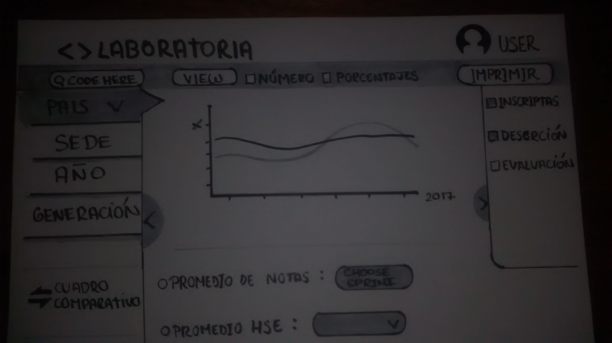
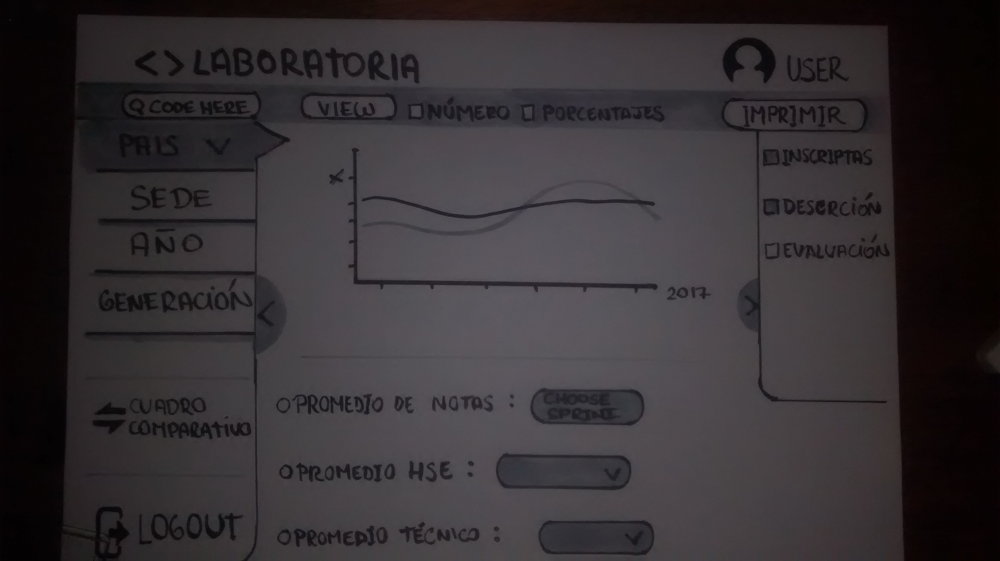
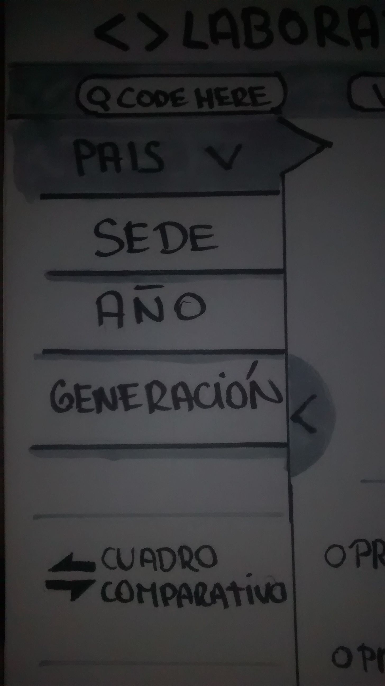
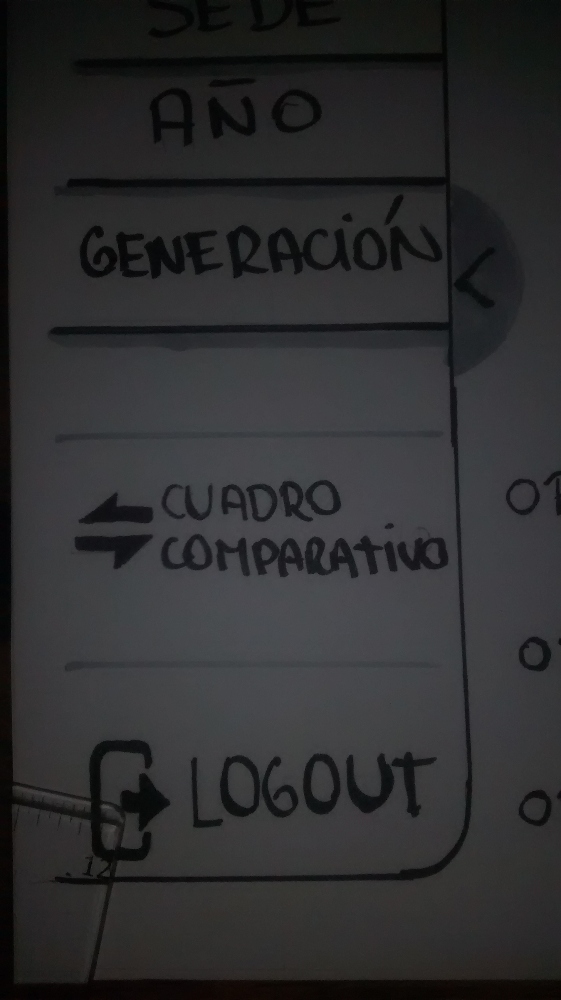
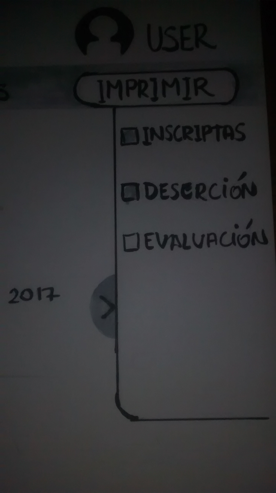
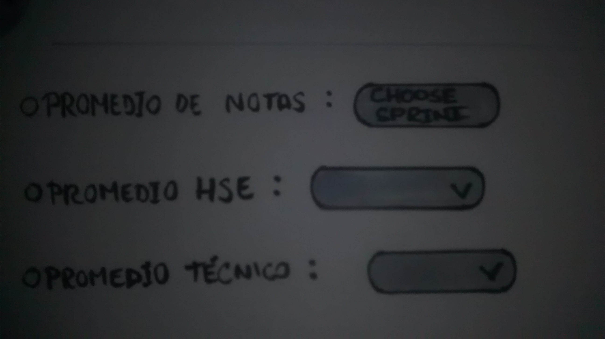
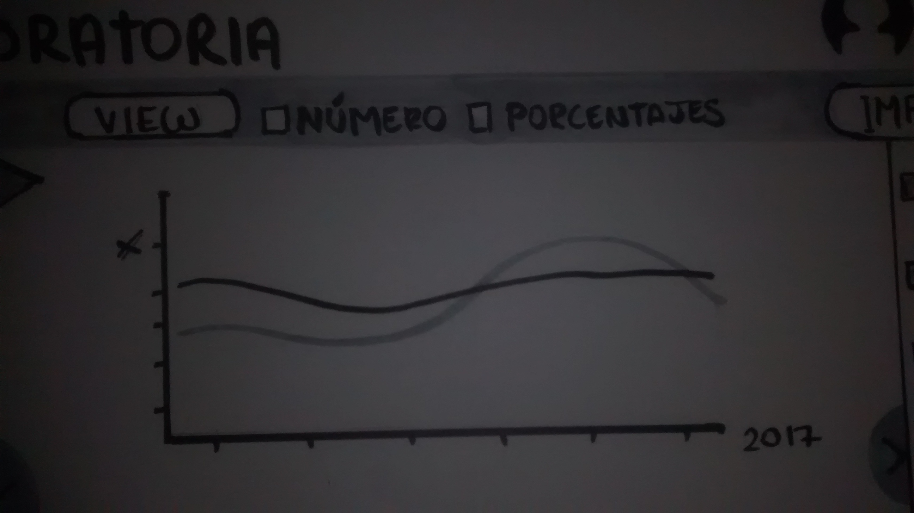

# Sketch - Dashboard de Laboratoria

##Objetivo

- El objetivo es crear un sketch del dashboard que crearemos para Laboratoria, ya que será utilizada por profesores, training managers, directores y gerentes de Laboratoria para ver rápidamente qué está pasando en el salón de clases de Laboratoria. En el dashboard, los usuarios podrán ver rápidamente estadísticas y datos en tiempo real como:

* número de alumnas inscritas
* número de alumnas que desertaron.
* número y % de alumnas que pasan el criterio mínimo de evaluación.
* Promedio de notas por sprint.
* Promedio de notas HSE.
* Promedio de notas técnicas.

## Vista general :

* Podemos apreciar a simple vista que tenemos una barra de navegacion que nos acompañará en toda la página con la cuenta y foto del usuario, tenemos un cuadro de búsqueda (CODE HERE) para que el usuario pueda buscar directamente el sprint/año/sede sólo con un código , luego tenemos la opción View para que pueda cambiar el estilo del gráfico a su gusto (circular ,en barras, en picos,en tablas),  también si el cliente desea puede tener los resultados por porcentajes o en números exactos, y al final, tiene la opción de imprimir la información .
* Mi idea es no sobrecargar el Dashboard de información que el cliente no desea , para esto el usuario tiene la posiblidad de escoger la información que requiera.

## Primera barra :

* En esta barra el usuario podrá escoger el pais,sede,año,generación de alumnas , cuando este en estado de hover aparecerá un submenú para las opciones (lima,mexico,chile,etc).
* También tenemos la opción de poder esconder la barra para que el Dashboard se pueda ampliar.

* Aquí el usuario podrá tener la opción de comparar y escoger sedes, años , generaciones,etc .
* Podrá desconectarse por seguridad.

## Segunda barra :

* En esta barra el cliente puede decidir si visualizar el numero de alumnas inscritas, las que desertaron  o las que pasaron el criterio minimo de evaluación. Se agregarán los datos al Dashboard.

## Información útil :

* Aquí también puede visualizar los promedios (tecnico ,HSE ,notas) por sprint , también se añadirá al Dashboard las opciones .

## Grafico :

* El tipo de  gráfico es decisión del cliente (en barras, circulares .etc) algunas personas tienen preferencia por algunos gráficos o las entienden mejor.
* Lo que varia aquí también es si el cliente desea números exactos o porcentajes .
* Se añañadirá la información que el cliente decida para no sobrecargar la información de datos innecesarios. 
